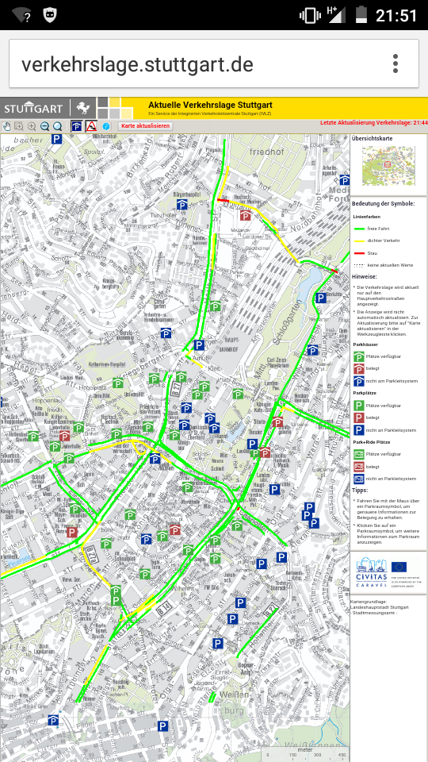
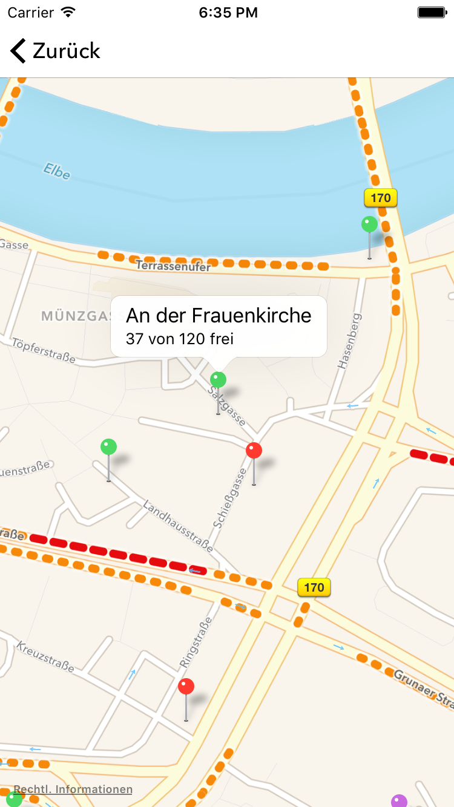
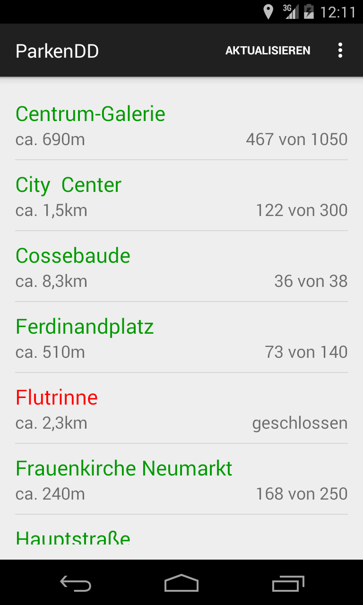
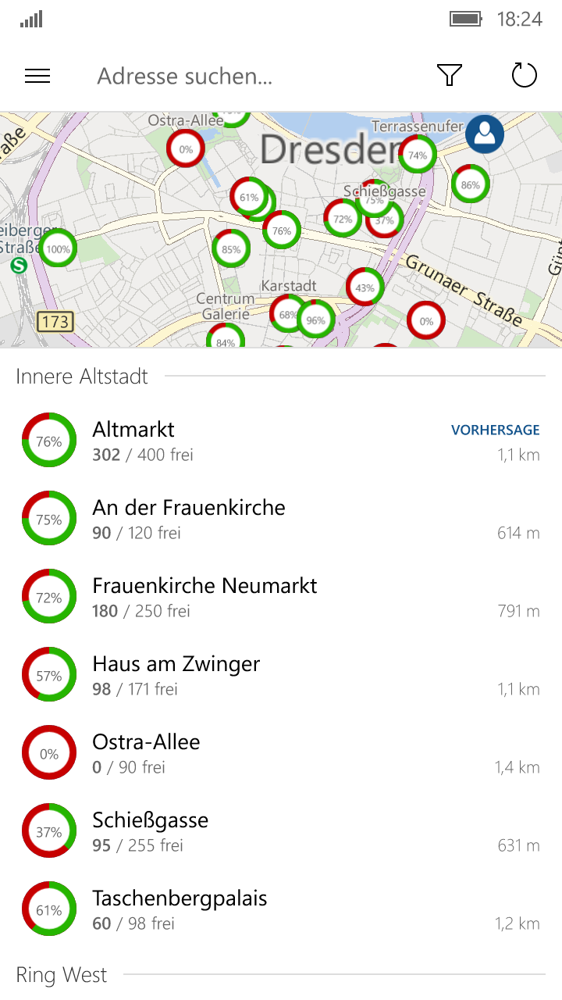

# LXC-to-Go
## (rapid lxc deployment for mobile devices and servers)

- Daniel ([github](https://github.com/plitc))
- Slides & Code: [github.com/plitc/lxc-to-go](https://github.com/plitc/lxc-to-go)


## Ablauf

0. [Installation](https://github.com/plitc/lxc-to-go/)
1. Konzept
2. Grundlagen
3. Praxis

Note:
- Grundlagen:


## Motivation

- Parkplatzübersicht Stuttgart auf Android

<a href="Screenshot_2015-10-23-21-51-37.png">
  
</a>


## Motivation

ParkenDD Apps:
<table>
<tr>
  <a href="ios-screen.png">
    
  </a>

  <a href="android-screen.png">
    
  </a>

  <a href="mobile_de1.png">
    
  </a>
</tr>
</table>


## Motivation

- Automatisierung
- Statistiken/Langzeitdaten
- Andere Darstellung/Mashups


## Grundlagen

- Was brauchen wir:
  - eine Programmiersprache,  ✓ ([Python](python.org))
  - die Webseiten herunterladen kann ✓ ([Requests](http://docs.python-requests.org/en/latest/))
  - und parsen kann ✓ ([BeautifulSoup](http://www.crummy.com/software/BeautifulSoup/))

Note:
- Viele Programmiersprachen sind grundsätzlich geeignet.
- Ich bevorzuge dynamische Programmiersprachen, wegen interaktiven Shell (später
  mehr)
- Wir müssten wie der Browser HTTP sprechen, Python kann das von Haus aus.
  Requests ist aber schöner zu benutzen
- Letztendlich muss das HTML der Webseite ausgewertet werden


## Grundlagen - HTML

```html
<!DOCTYPE html>
<html>
  <head>
    <meta charset="utf-8" />
    <title>Präsidenten</title>
  </head>
  <body>
    <table id="präsidenten">
      <tr>
        <th>Präsidenten</th>
        <th>Regierungszeiten</th>
      </tr>
      <tr>
        <td>Abraham Lincoln</td>
        <td class="date">4. März 1861 - 15. April 1865</td>
      </tr>
      <tr>
        <td>Andrew Johnson</td>
        <td class="date">15. April 1865 - 4. März 1869</td>
      </tr>
      <tr>
        <td>Ulysses S. Grant</td>
        <td class="date">4. März 1869 - 4. März 1877</td>
      </tr>
    </table>
  </body>
</html>
```


## Grundlagen - CSS Selektoren

<table>
<tr><td>Selector</td> <td>Example</td> <td>Example description CSS</td></tr>
<tr><td>.class</td> <td>.date</td> <td>Wählte alle Zeilen mit der Klasse .date aus.</td></tr>
<tr><td>#id</td> <td>#präsidenten</td> <td>Wählt die Tabelle mit der ID Präsident aus.</td></tr>
<tr><td>element</td> <td>tr</td> <td>Wählt alle Zeilen der Tabelle aus.</td></tr>
<tr><td>Komplexbeispiel</td> <td>#präsidenten tr:first-child</td> <td>1. Zeile der Präsidententabelle</td></tr>
</table>


## Grundlagen - CSS Selektoren
- Einführung für [CSS-Selektoren](https://developer.mozilla.org/de/docs/Web/Guide/CSS/Getting_started/Selektoren)
- Einführung für [XPath](https://de.wikipedia.org/wiki/XPath)


## Grundlagen - Beispiel

```python
#!/usr/bin/env python
import requests, random
from bs4 import BeautifulSoup

url = "https://en.wikipedia.org/wiki/Nicolas_Cage_filmography"
doc = requests.get(url)
soup = BeautifulSoup(doc.text, 'html.parser')
rows = soup.select("table.wikitable.sortable tr")
choice = random.choice(rows)
print(choice.select("td i a")[0].text)
```

```bash
$ python3 random_cage.py
```


## Beispiel

Luzern: http://www.pls-luzern.ch/de


## Ihr seid dran

- Vorschlag:
  - Bregenz: https://www.bregenz.gv.at/sicherheit-verkehr/verkehr-und-parken/parkleitsystem.html
  - [Andere Beispiele](https://github.com/offenesdresden/ParkAPI/issues?q=is%3Aclosed+label%3Anew_data+is%3Aissue)
- Python Referenz: http://www.cs.put.poznan.pl/csobaniec/software/python/py-qrc.html
- Beautiful Soup: http://www.crummy.com/software/BeautifulSoup/bs4/doc/
- Requests: http://docs.python-requests.org/en/latest/
